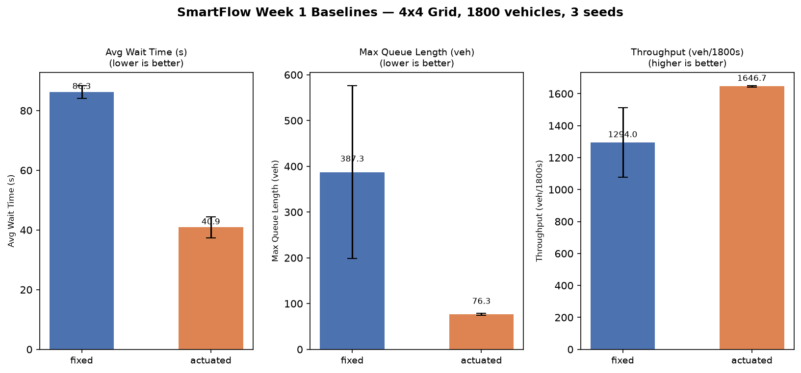

# 🚦 SmartFlow

> **Teaching traffic lights to think — so cars spend less time waiting and more time moving.**

SmartFlow is a research platform that uses **AI and simulation** to make traffic signals smarter.
Instead of lights that blindly switch every 42 seconds whether cars are there or not,
SmartFlow trains agents that *watch* traffic and decide in real time when to turn green.

Built as a B.Tech final-year project at CMRCET — but the results are real, and so are the
cases where the AI loses.

---

## 🧠 The Big Idea (explain it like I'm 10)

Imagine you're stuck at a red light. There are 20 cars behind you... and zero cars on the
green side. The light stays red for 40 more seconds anyway. Annoying, right?

That's **fixed-time** control — the city sets a timer and the lights just follow it forever,
no matter what's actually happening on the road.

SmartFlow replaces that timer with an **AI brain** that:

1. Watches how many cars are waiting at each intersection
2. Learns from millions of simulated cars which signal timing works best
3. Makes the green light last longer when there's a big queue, shorter when the road is empty

Then it does the harder thing: it gets **twelve** intersections to cooperate, instead of
each one selfishly clearing its own queue by dumping traffic on its neighbour.

---

## 📊 Results

<!-- RESULTS:BEGIN -->
<!-- Generated by src/update_readme.py — do not edit by hand. -->

All figures are mean ± standard deviation over 3 seeds, measured by the same
per-second collector (`src/metrics.py`) for RL and baselines alike.

### Week 1 — fixed-time vs actuated baselines (corridor, 3 seeds)

| Controller | Avg wait (s) | Max queue (veh) | Throughput (veh) | CO2 (kg) | Avg wait (s) vs fixed | Max queue (veh) vs fixed | Throughput (veh) vs fixed | CO2 (kg) vs fixed |
|---|---|---|---|---|---|---|---|---|
| fixed | 86.26 ± 1.73 | 387.33 ± 154.39 | 1294.00 ± 177.28 | 731.13 ± 63.11 | — | — | — | — |
| actuated | 40.89 ± 2.88 | 76.33 ± 1.70 | 1646.67 ± 3.40 | 508.26 ± 11.21 | +52.6% | +80.3% | +27.2% | +30.5% |

### Week 2 — single-agent PPO on sumo-rl's standard benchmark (3 seeds)

| Controller | Avg wait (s) | Max queue (veh) | Throughput (veh) | Avg wait (s) vs fixed | Max queue (veh) vs fixed | Throughput (veh) vs fixed |
|---|---|---|---|---|---|---|
| fixed | 16.39 ± 0.05 | 65.67 ± 1.70 | 2089.00 ± 2.83 | — | — | — |
| ppo | 4.00 ± 0.45 | 22.00 ± 2.83 | 2429.67 ± 35.64 | +75.6% | +66.5% | +16.3% |

Sanity check against published behaviour: `outputs/week2_literature_note.md`.

### Week 3 — PPO on one corridor junction (B1), other 11 fixed-time (3 seeds)

**At the controlled junction** (the primary claim):

| Controller | Avg wait (s) | Max queue (veh) | Throughput (veh) | Avg wait (s) vs fixed | Max queue (veh) vs fixed | Throughput (veh) vs fixed |
|---|---|---|---|---|---|---|
| fixed | 50.01 ± 14.28 | 91.33 ± 10.84 | 545.33 ± 83.37 | — | — | — |
| actuated | 17.26 ± 5.28 | 30.67 ± 6.94 | 736.67 ± 3.09 | +65.5% | +66.4% | +35.1% |
| actuated_single | 24.43 ± 7.89 | 36.33 ± 11.09 | 723.33 ± 8.81 | +51.1% | +60.2% | +32.6% |
| ppo | 16.34 ± 11.23 | 44.33 ± 38.87 | 647.33 ± 130.38 | +67.3% | +51.5% | +18.7% |
| ppo_final_iterate | 16.34 ± 11.23 | 44.33 ± 38.87 | 647.33 ± 130.38 | +67.3% | +51.5% | +18.7% |

`actuated_single` is the controlled comparison — only B1 upgraded, same as `ppo`.

**Corridor-wide** (one junction of twelve cannot move this much, which is the
point of Week 4):

| Controller | Avg wait (s) | Max queue (veh) | Throughput (veh) | Avg wait (s) vs fixed | Max queue (veh) vs fixed | Throughput (veh) vs fixed |
|---|---|---|---|---|---|---|
| fixed | 86.26 ± 1.73 | 387.33 ± 154.39 | 1294.00 ± 177.28 | — | — | — |
| actuated | 40.89 ± 2.88 | 76.33 ± 1.70 | 1646.67 ± 3.40 | +52.6% | +80.3% | +27.2% |
| actuated_single | 78.54 ± 2.93 | 146.00 ± 0.82 | 1596.00 ± 15.94 | +8.9% | +62.3% | +23.3% |
| ppo | 73.31 ± 5.53 | 260.67 ± 182.72 | 1469.33 ± 193.99 | +15.0% | +32.7% | +13.6% |
| ppo_final_iterate | 73.31 ± 5.53 | 260.67 ± 182.72 | 1469.33 ± 193.99 | +15.0% | +32.7% | +13.6% |

### Weeks 4-5 — corridor-wide multi-agent RL, base demand (3 seeds)

| Controller | Avg wait (s) | Max queue (veh) | Throughput (veh) | 95th pct wait (s) | Worst wait (s) | Avg wait (s) vs fixed | Max queue (veh) vs fixed | Throughput (veh) vs fixed | 95th pct wait (s) vs fixed | Worst wait (s) vs fixed |
|---|---|---|---|---|---|---|---|---|---|---|
| fixed | 83.10 ± 1.62 | 427.67 ± 176.42 | 1280.00 ± 189.40 | 211.33 ± 5.56 | 721.00 ± 127.38 | — | — | — | — | — |
| actuated | 40.89 ± 2.88 | 76.33 ± 1.70 | 1646.67 ± 3.40 | 122.33 ± 7.32 | 243.00 ± 25.66 | +50.8% | +82.2% | +28.6% | +42.1% | +66.3% |
| marl_independent | 17.80 ± 0.28 | 41.00 ± 2.83 | 1679.67 ± 4.11 | 47.67 ± 0.94 | 95.33 ± 3.40 | +78.6% | +90.4% | +31.2% | +77.4% | +86.8% |
| marl_shared_w5 | 17.85 ± 0.38 | 149.67 ± 150.15 | 1569.33 ± 148.02 | 48.00 ± 0.82 | 288.67 ± 271.07 | +78.5% | +65.0% | +22.6% | +77.3% | +60.0% |
| marl_shared_w5gnn | 18.16 ± 0.14 | 42.33 ± 2.06 | 1678.67 ± 6.65 | 48.00 ± 0.82 | 96.00 ± 2.83 | +78.2% | +90.1% | +31.1% | +77.3% | +86.7% |
| marl_shared_w5nocoord | 18.16 ± 0.14 | 42.33 ± 2.06 | 1678.67 ± 6.65 | 48.00 ± 0.82 | 96.00 ± 2.83 | +78.2% | +90.1% | +31.1% | +77.3% | +86.7% |
| marl_shared_w5nofair | 18.16 ± 0.14 | 42.33 ± 2.06 | 1678.67 ± 6.65 | 48.00 ± 0.82 | 96.00 ± 2.83 | +78.2% | +90.1% | +31.1% | +77.3% | +86.7% |
| marl_shared_w5strong | 18.16 ± 0.14 | 42.33 ± 2.06 | 1678.67 ± 6.65 | 48.00 ± 0.82 | 96.00 ± 2.83 | +78.2% | +90.1% | +31.1% | +77.3% | +86.7% |

- `marl_independent` — Week 4: one policy per junction, local reward only.
- `marl_shared_w5` — Week 5: one parameter-shared policy, green-wave shaping,
  Lagrangian fairness constraint.

**Fairness constraint, measured by ablation:** worst-case vehicle wait is
96 s without the Lagrangian term and 289 s with it (-200.7%).

### Week 6 — average wait (s) across demand scenarios

| Scenario | fixed | actuated | marl_independent | marl_shared_w5 |
|---|---|---|---|---|
| `base` | 83.1 | 40.9 | 17.8 | 17.9 |
| `light` | 37.0 | 6.3 | 6.6 | 6.7 |
| `peak` | 68.9 | 71.2 | 42.5 | 39.2 |
| `asymmetric` | 54.1 | 11.3 | 10.9 | 10.8 |

Policies were trained on `base` only, so the other columns measure
generalisation. The full analysis, including every case where RL loses to a
baseline, is in [BENCHMARK_REPORT.md](BENCHMARK_REPORT.md).

### Week 5 — online learning

- deployed into `asymmetric`: 10.3 s frozen -> 10.3 s after 8 online rounds (+0.0%)
- deployed into `peak`: 40.6 s frozen -> 38.9 s after 6 online rounds (+4.1%)

<!-- RESULTS:END -->

Charts: [`outputs/`](outputs/) · Full analysis: [BENCHMARK_REPORT.md](BENCHMARK_REPORT.md)



---

## 🧪 What each week proved

Definitions of Done are reported as they came out, including the two that failed.

| Week | Question | Answer | DoD |
|---|---|---|---|
| 1 | Does adaptive beat fixed-time at all? | Yes — actuated control cut average wait 53% on the corridor. | ✅ |
| 2 | Does the RL pipeline work on a *standard* benchmark? | Yes — PPO cut wait 76% on sumo-rl's 2-way intersection. [Sanity check](outputs/week2_literature_note.md) | ✅ |
| 3 | Does it transfer to one junction of a real corridor? | It beats fixed-time there by 67%, but **loses to an actuated controller** at the same junction on queue and throughput. One junction of twelve also barely moves the corridor. [Report](outputs/week3_report.md) | ❌ |
| 4 | Can all twelve junctions learn at once without diverging? | Yes — 0 of 3 seeds diverged, with a measured 20–28% rate of gridlock collapses along the way. [Report](outputs/week4_report.md) · [Notes](outputs/week4_nonstationarity_notes.md) | ✅ |
| 5 | Does parameter sharing + green-wave shaping + a fairness cap beat the baselines? | Corridor-wide RL does beat both baselines — but the *shaping* adds nothing, and one seed of the shaped run jams the corridor. The fairness constraint provably cannot be shown to work here. [Report](outputs/week5_report.md) | ❌ |
| 6 | Does it hold up when the traffic changes? | It generalises well to light and asymmetric demand and degrades gracefully at peak, but loses to fixed-time on peak queue length. [BENCHMARK_REPORT.md](BENCHMARK_REPORT.md) | ✅ |

**The most interesting result is a negative one.** Five policy variants — with and
without the fairness constraint, with and without green-wave shaping, with a 20×
stronger fairness weight, and with a graph-attention network instead of an MLP —
produce *byte-identical* evaluation metrics. They are genuinely different networks
(one has 16k parameters instead of 138k), but they agree on **100% of the decisions
that can actually move a signal**. With a binary next-phase action and a 5-second
minimum green, the greedy policy on this corridor is saturated: reward shaping changes
what the policy *believes* without changing what it *does*. Measured, not assumed —
`src/policy_agreement.py`.

---

## 🗺️ How the Project is Structured

```
smartflow/
│
├── 📁 data/               ← Road network and vehicle routes
│   ├── corridor.net.xml              — the 4×4 grid map (12 traffic lights)
│   ├── corridor_actuated.net.xml     — same map, all lights actuated
│   ├── corridor_actuated_B1.net.xml  — only B1 actuated (Week 3's control condition)
│   ├── corridor.rou.xml              — 1,800 trips
│   └── corridor_{light,peak,asymmetric}.rou.xml — Week 6 stress scenarios
│
├── 📁 src/
│   │  ── foundation ──
│   ├── smartflow_env.py       — the environment layer (read this first)
│   ├── metrics.py             — one metric collector, used by every controller
│   ├── analysis.py            — aggregation, tables and charts
│   │
│   │  ── weeks 1–3: baselines and single-agent RL ──
│   ├── eval.py                — Week 1 benchmark harness (fixed contract)
│   ├── make_actuated_net.py / make_single_actuated_net.py
│   ├── train_ppo_benchmark.py / eval_benchmark.py / compare_week2.py
│   ├── train_ppo_corridor.py  / eval_corridor.py    / compare_week3.py
│   │
│   │  ── weeks 4–6: multi-agent ──
│   ├── marl_env.py            — PettingZoo parallel env + observation alignment
│   ├── rewards.py             — green-wave shaping + Lagrangian fairness
│   ├── gnn_encoder.py         — graph-attention policy torso (PyTorch Geometric)
│   ├── train_marl_corridor.py — RLlib PPO, independent or parameter-shared
│   ├── eval_marl_corridor.py  — deterministic evaluation
│   ├── online_learning.py     — keep learning after deployment
│   ├── scenarios.py           — light / peak / asymmetric demand
│   ├── compare_week4.py / compare_week5.py / week6_benchmark.py
│   │
│   │  ── visualiser ──
│   ├── viz_recorder.py        — record a live TraCI run into a compact replay
│   ├── viz_build.py           — inline replays into one self-contained page
│   ├── viz/template.html      — the control-room UI (canvas renderer)
│   │
│   │  ── tooling ──
│   ├── run_experiments.py     — the whole experiment matrix, one command
│   ├── policy_agreement.py    — do the policy variants actually behave differently?
│   ├── select_best_checkpoint.py — validation-based checkpoint selection
│   ├── env_smoketest.py       — verify SUMO + both environments
│   └── test_core_logic.py     — self-checks for the correctness-critical logic
│
└── 📁 outputs/            ← Results (committed — this is the proof of work)
    ├── metrics.csv, week2_benchmark_metrics.csv,
    │   week3_corridor_metrics.csv, marl_metrics.csv
    ├── week{2,3,4,5}_*.md      — per-week reports and notes
    └── *.png                   — every chart
```

---

## ⚙️ Setup

You need **Python 3.11+** and **SUMO 1.27.1**, with `SUMO_HOME` set as a Windows User
environment variable pointing at your SUMO folder.

```powershell
python -m venv venv
.\venv\Scripts\Activate.ps1
pip install -r requirements.txt
```

---

## 🚀 Run It Yourself

```powershell
.\venv\Scripts\Activate.ps1
```

**Check everything works** (SUMO, both environments, and the pure logic):

```powershell
python src\env_smoketest.py
```

```powershell
python src\test_core_logic.py
```

**Week 1 — baselines:**

```powershell
python src\eval.py --controller fixed --seed 0
```

```powershell
python src\compare_baselines.py
```

**Week 3 — single-agent PPO on one junction:**

```powershell
python src\train_ppo_corridor.py --seed 0
```

```powershell
python src\eval_corridor.py --controller ppo --seeds 0 1 2
```

```powershell
python src\compare_week3.py
```

**Weeks 4–6 — the full multi-agent matrix** (several hours of CPU):

```powershell
python src\run_experiments.py --stage all
```

Then regenerate every report and chart:

```powershell
python src\compare_week4.py
```

```powershell
python src\compare_week5.py
```

```powershell
python src\week6_benchmark.py
```

```powershell
python src\update_readme.py
```

---

## 🎬 Watch it run

`outputs/viz/corridor_control_room.html` is a single self-contained page that replays
the corridor: roads, signal heads changing per approach, and every vehicle — blue when
moving, red when stopped in a queue. Fixed-time and RL can be played **side by side on
identical traffic**, which is the clearest way to see the result. At t = 20:00,
fixed-time has 116 cars stopped; the RL policy has 13.

It replays recorded TraCI output rather than driving SUMO live, so it opens anywhere
with no server and cannot fail mid-demo. Regenerate it with:

```powershell
python src\viz_recorder.py --controller fixed
```

```powershell
python src\viz_recorder.py --controller actuated
```

```powershell
python src\viz_recorder.py --controller marl --mode shared --tag w5
```

```powershell
python src\viz_build.py
```

Add `--scenario peak` to any recorder call to watch the corridor gridlock instead.

---

## 🔬 How the Benchmark Works

Every controller — fixed-time, actuated, single-agent PPO, and every multi-agent
variant — is measured by the **same collector** in `src/metrics.py`, sampled once per
*simulated second*:

- **avg_wait_time_s** — mean seconds a completed trip spent stopped
- **max_queue_len** — peak number of halting vehicles
- **throughput_veh** — vehicles that reached their destination
- **total_co2_kg** — integrated CO₂ emissions
- **wait_p95_s / worst_vehicle_wait_s** — the tail, which is what the fairness
  constraint is judged on

Sampling per *agent decision* instead of per simulated second would divide every
waiting time by `delta_time` and silently flatter the RL controllers, so the RL path
hooks the collector into the simulation loop rather than the decision loop.

Every reported figure is a **3-seed mean ± standard deviation**.

---

### One environment detail worth knowing

`sumo_rl.SumoEnvironment` builds a controller for *every* traffic light in the network
and **overwrites that junction's signal program** while doing it. On a 12-junction
corridor where only one junction is under RL control, that silently rewrites the other
eleven — corridor throughput collapsed from 1520 vehicles to 56, and the environment ran
15× slower because every step still polled all twelve junctions.

`smartflow_env.ControlledSumoEnvironment` restricts control to the junctions actually
being learned, so untouched junctions keep the program defined in the `.net.xml`.
`src/env_smoketest.py` guards against this regressing.

---

## 🗓️ 12-Week Roadmap

| Phase | Weeks | Status |
|---|---|---|
| **A — Foundation** | 1–3 | ✅ Simulation, baselines, single-agent RL |
| **B — Multi-Agent** | 4–6 | ✅ Independent → parameter-shared MARL, fairness, GNN, stress tests |
| **C — Features** | 7–9 | ⬜ Knowledge graph, vision, federated learning |
| **D — Platform** | 10–11 | ⬜ Microservices, Kubernetes, live dashboard |
| **E — Demo** | 12 | ⬜ Final report, demo video, viva prep |

Phase C/D scaffolding (FastAPI service skeletons, Docker Compose, CI) exists in
`services/`, `tests/` and `.github/`, but nothing in those phases is claimed as working
— they are stubs awaiting their scheduled weeks.

---

## 🛠️ Tech Stack

| Layer | Technology |
|---|---|
| Traffic simulation | SUMO 1.27.1 + TraCI |
| Single-agent RL | Stable-Baselines3 (PPO) |
| Multi-agent RL | Ray RLlib 2.58 (PPO) + PettingZoo |
| Graph learning | PyTorch Geometric (GATConv) |
| Backend services | FastAPI (5 domain services) |
| Frontend dashboard | Next.js 15 + Recharts |
| Knowledge graph | Neo4j AuraDB + Chroma |
| Containers | Docker → k3d |

---

## ⚠️ Honest limitations

- One synthetic 12-junction grid, one demand generator. Nothing here demonstrates
  transfer to a real road network — the OSM corridor is still deferred from Week 1.
- Three seeds: enough to show variance, not enough for confidence intervals.
- Policies are trained on the base demand only; the Week 6 scenarios test
  generalisation, and a policy retrained per scenario would likely do better.
- Simulation only. Nothing has been load-tested, and no claim is made about real-time
  or production performance.

---

## 👤 Author

**Rishik** — B.Tech CSE, CMRCET
Solo build · 12-week window · 2026
